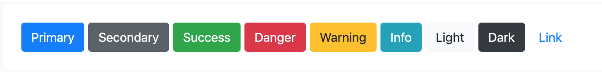
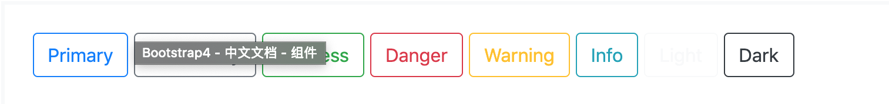

#按钮

使用 Bootstrap 自定义按钮样式到表单、对话框等操作，并支持多种按钮大小、状态等。

```
<button type="button" class="btn btn-primary">Primary</button>
<button type="button" class="btn btn-secondary">Secondary</button>
<button type="button" class="btn btn-success">Success</button>
<button type="button" class="btn btn-danger">Danger</button>
<button type="button" class="btn btn-warning">Warning</button>
<button type="button" class="btn btn-info">Info</button>
<button type="button" class="btn btn-light">Light</button>
<button type="button" class="btn btn-dark">Dark</button>
<button type="button" class="btn btn-link">Link</button>
```

* 按钮标签
	
	- .btn 是设计为了于 button 元素一起使用。 但是，你也可以在 a 或 input 元素上使用这些 Class（尽管有些浏览器可能会使用稍微不同的渲染）。
	- 当在用于触发页面内功能（例如折叠内容）的 a元素上使用按钮类，而不是链接到新页面或当前页面中的部分时，这些 a元素应该再加上 role="button" 以优化用户使用屏幕阅读器等辅助性技术时的体验。
```
<a class="btn btn-primary" href="#" role="button">Link</a>
<button class="btn btn-primary" type="submit">Button</button>
<input class="btn btn-primary" type="button" value="Input">
<input class="btn btn-primary" type="submit" value="Submit">
<input class="btn btn-primary" type="reset" value="Reset">
```

* 外框按钮

需要一个按钮，但不是用填满的背景颜色？用 .btn-outline-* 替换默认修饰用的 Class，以移除任何按钮上的所有背景色及背景图。

```
<button type="button" class="btn btn-outline-primary">Primary</button>
<button type="button" class="btn btn-outline-secondary">Secondary</button>
<button type="button" class="btn btn-outline-success">Success</button>
<button type="button" class="btn btn-outline-danger">Danger</button>
<button type="button" class="btn btn-outline-warning">Warning</button>
<button type="button" class="btn btn-outline-info">Info</button>
<button type="button" class="btn btn-outline-light">Light</button>
<button type="button" class="btn btn-outline-dark">Dark</button>
```

* 大小

想要较大或较小的按钮？加入 .btn-lg 或 .btn-sm 来应用尺寸。
```
<button type="button" class="btn btn-primary btn-lg">Large button</button>
<button type="button" class="btn btn-secondary btn-lg">Large button</button>
 ```
```
<button type="button" class="btn btn-primary btn-sm">Small button</button>
<button type="button" class="btn btn-secondary btn-sm">Small button</button>
```

增加 .btn-block.创建块级别的按钮（等同于外元素的宽）。
```
<button type="button" class="btn btn-primary btn-lg btn-block">Block level button</button>
<button type="button" class="btn btn-secondary btn-lg btn-block">Block level button</button>
```

* 启用状态

当启用时，按钮将出现按压（背景较暗、边框较暗、内阴影）。 沒有必要在 button添加一个 Class，因为它们使用伪类。但是，如果你需要以动态方式改变状态，则可以使用 .active (并包括 aria-pressed="true" 属性) 应用相同的启用外观。
```
<a href="#" class="btn btn-primary btn-lg active" role="button" aria-pressed="true">Primary link</a>
<a href="#" class="btn btn-secondary btn-lg active" role="button" aria-pressed="true">Link</a>
```


* 停用状态

通过将 disabled 布林属性添加到任何 button 元素，使按钮看起来处于停用状态。
```
<button type="button" class="btn btn-lg btn-primary" disabled>Primary button</button>
<button type="button" class="btn btn-secondary btn-lg" disabled>Button</button>
```
使用 a元素的停用略有不同：

	a元素不支持 disabled 属性，所以你必须添加 .disabled 使它在视觉上看起来被禁用。
	包括友善的样式行为设计，以禁用a按钮上的所有pointer-events 在支持该属性的浏览器中，会看不到禁用的图标。
	禁用按钮应包含 aria-disabled="true" 属性来向辅助性技术指示元素的状态。
```
<a href="#" class="btn btn-primary btn-lg disabled" tabindex="-1" role="button">Primary link</a>
<a href="#" class="btn btn-secondary btn-lg disabled" tabindex="-1" role="button">Link</a>
```

链接功能警告

	为了安全起见，在这些链接上添加一个 tabindex="-1" 属性防止他们应用 focus，并使用自定义的 JavaScript 来禁用它们的功能。

* 按钮组
```
<div class="btn-group">
    <button type="button" class="btn btn-secondary">1</button>
    <button type="button" class="btn btn-secondary">2</button>
    <button type="button" class="btn btn-secondary">3</button>
</div>
```